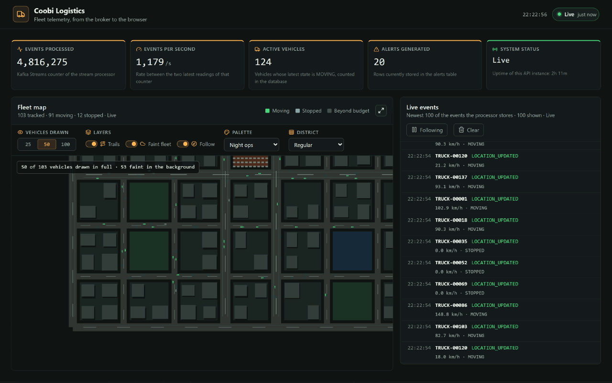
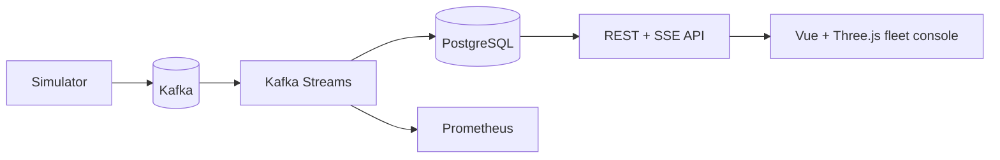

# Coobi Logistics

## A fleet pipeline you can understand in one minute

Coobi Logistics turns live vehicle telemetry into a queryable fleet view: Kafka carries the events, Kafka Streams detects speeding/stopped vehicles, PostgreSQL stores the read model, Prometheus measures the system, and a Vue + Three.js console renders the fleet in real time.



**Measured proof:** 1,000 events/s sustained at p95 **1.41 ms**. At 10,000 offered events/s the generator sustained **9,999.97/s** while the processor handled **1,483.51/s**; the backlog is reported honestly in [`docs/benchmarks.md`](docs/benchmarks.md).

| Explore | Link |
| --- | --- |
| Architecture | [`docs/architecture.md`](docs/architecture.md) |
| Event contracts | [`docs/events.md`](docs/events.md) |
| Benchmark report | [`docs/benchmarks.md`](docs/benchmarks.md) |
| Local deployment | [`docs/deployment.md`](docs/deployment.md) |

The same pages are published as a documentation site at <https://pepoychris.github.io/coobi-logistics/>.
GitHub Pages builds it straight from this branch - `_config.yml` plus `_layouts/` and
`assets/docs/` are the whole site definition, with no separate build step to reproduce.

## What makes it interesting

- **Event-driven:** keyed Kafka telemetry, DLQ handling, replay-safe processing.
- **Stateful:** per-vehicle latest state plus transition alerts in Kafka Streams.
- **Observable:** Micrometer, Prometheus, Kafka client metrics and reproducible captures.
- **Visual:** a procedural Three.js fleet map with custom mini-vehicles, live SSE KPIs and a bounded event feed.
- **Tested:** deterministic unit suites, real Kafka/PostgreSQL Testcontainers and an end-to-end smoke test.

## Run it

```bash
cp .env.example .env
docker compose up --build
```

Open <http://localhost:5173>. The stack includes Kafka, PostgreSQL, generator, processor, API, dashboard and Prometheus. No Java, Node, Kafka or PostgreSQL installation is required on the host.

The dashboard lets you choose 25/50/100 fully rendered vehicles, switch between fleet themes, toggle trails/background density and follow the fleet. Vehicles beyond the render budget remain as faint background cloud points so the browser never creates thousands of detailed meshes.

## Architecture



Read [`docs/architecture.md`](docs/architecture.md) for the full flow and [`docs/events.md`](docs/events.md) for schemas, keys and DLQ behavior.

## Testing and performance

```bash
mvn test
mvn -Dintegration-tests test
python -m unittest discover -s infrastructure/benchmarks/tests
```

The benchmark harness accepts `--scenario vehicles/events-per-second/duration` and `--matrix`, writes raw samples and never invents unavailable values. Two five-minute scenarios were measured; the larger scenarios are explicitly marked as not run.

## Where it runs

The pipeline runs on one machine with `docker compose up --build`, and that local stack is
what every figure in these pages was measured on. Each published port is bound to
`127.0.0.1`, and the repository ships no tunnel, no reverse proxy and no public ingress, so
Kafka, PostgreSQL, Prometheus and the Actuator endpoints stay on the host that runs them.
[`docs/deployment.md`](docs/deployment.md) is the reference for that stack.

## Technology

Java 21 · Spring Boot · Apache Kafka · Kafka Streams · PostgreSQL · Vue 3 · TypeScript · Three.js · Prometheus · Docker Compose · Testcontainers
