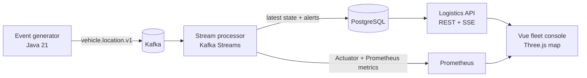
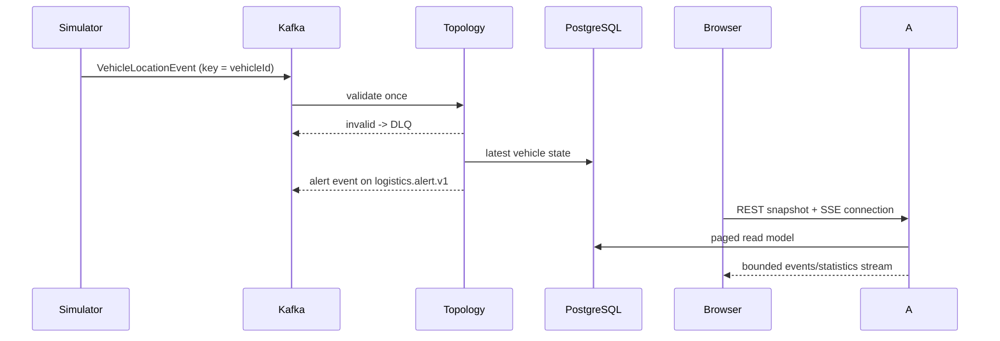

# Architecture in one minute

Coobi Logistics is a small, observable event pipeline: a simulator publishes vehicle telemetry, Kafka carries it, Kafka Streams derives state and alerts, PostgreSQL keeps the read model, and a Vue/Three.js dashboard reads the result over REST + SSE.

## The event path

## Why these boundaries

- Kafka absorbs bursts and preserves per-vehicle key ordering.
- Kafka Streams owns stateful transitions: speeding and prolonged stops.
- PostgreSQL is a query-friendly read model, not a telemetry archive.
- SSE gives the browser live updates without exposing Kafka or sending every raw record.
- Prometheus measures the real path; benchmark claims are backed by captured runs in [`docs/benchmarks.md`](benchmarks.md).

## Portfolio scope

The public-deployment work described as MVP-12.4 is intentionally excluded from this release. No Cloudflare tunnel, domain, or public infrastructure configuration is added.

See [`events.md`](events.md) for contracts and [`deployment.md`](deployment.md) for local startup.
